# AI4ADAPT_env

This is a proxy to the `currently private` repository at [AI4ADAPT_env](https://github.com/ax1/ai4adapt_env).

While this repository is private, we encourage other users to create their own adaptations to the real world because:
- Our development involved a cloud environments with multiple machines apart from monitoring machines, agents deployed, etc. It may be overkill for most of the users.
- The real system as starting point is usually pretty different depending on the experiment, so it is better to adapt to your use case (real machines, virtual machines, containerized apps, network devices, etc) into a dedicated environment, and not spend most of the time in devops activities.

For more information, we recommend start browsing into the [AI4ADAPT](https://github.com/ax1/ai4adapt) repository, where more documentation, diagrams, and useful links are provided. See also how to convert real systems into adapt-like environments like this repository. The RL framework is ready to interact with any real system as long as it complies with the interface to connect them.

AI4adapt_env runs in two modes:
- train: when the agent is training, the defenses are executed in the real devices, returning the status.
- recommend: the agent is still running, but in this mode, the environment only recommends the best defense provided by the agent. The consumer of this recommendation is the responsible to execute the defense.

During the project, the training mode was set in a SANDBOXED infrastructure, where the agent was free to explore and perform defensive actions, and the environment evolved from normal situation to being attacked by different ways. Once trained, the agent was deployed into production mode, where AI4SOAR is the security application. In production, the agent runs in recommendation mode just by starting up this ai4adapt_env with that flag, so we keep AI4SOAR to control exclusively any defensive operation but leave the agent autonomously to inspect the system status and suggest potential actions when asked.

```mermaid
flowchart LR
A[👮AI4SOAR]
B[🤖AI4ADAPT]
C[🔌 🏦 🏥SYSTEM]
B -.-|Observations 👀|C
A -->|1-Help! 😭|B
B -->|🥷 2-Defense|A
A -->|3-Execute defense 🥷|C
``` 

> LICENSE: proprietary